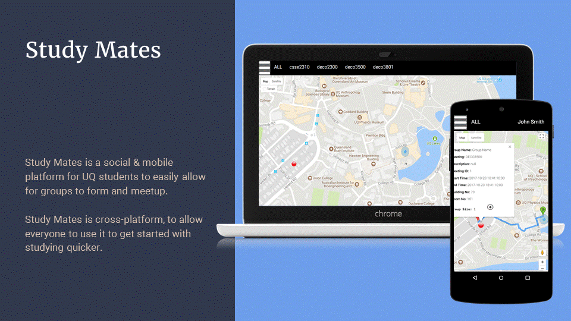
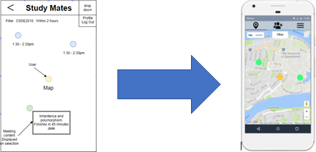
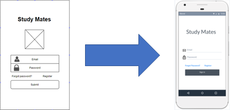
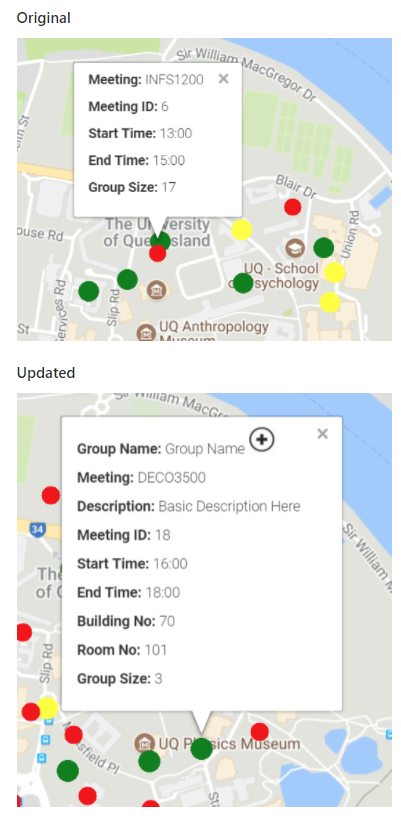
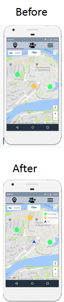

# Study Mates #
**DECO3500 Project Proposal**

**Team Name** : Equals-Null  
**Note:** assigned-null for github

#### Final Prototypes
Interactive Marvel prototype: https://marvelapp.com/9jc9dge
* Can navigate around the app by clicking on the interface.
* Clicking anywhere inside the mobile screen will highlight interactable components
* Represents our final design for our prototype and what we would like to implement into the zone

Zone Web App: https://study-mates.uqcloud.net/
* Proof of concept for incorporating UQ SSO and Google Maps API
* You will have to use UQ SSO to sign in and then you will see the web app
* Should see at the top subjects your currently taking
* Click on markers to view group details and see navigation
* Limited functionality outside of that

#### Other Resources
* Initial User Interview Questions: https://drive.google.com/open?id=1ql6zGOOVPxK1zgsZRtH7CEyDXIX_gV2NVWzuI45syEk
* Wireframes: https://drive.google.com/file/d/0B9Pu9DHDTCw5c01RX3J4M2o1YW8/view?usp=sharing 
* Google Maps: https://developers.google.com/maps/
* Digital Prototype Questionaire : https://docs.google.com/forms/d/e/1FAIpQLSdaaOPs-5j2JG1vQ2Vq70YWMqUoDOhVttZLfVqCRad9KAibQQ/viewform
* Consent Form (PDF): https://study-mates.uqcloud.net/consent-form.pdf

### **Contributors** 

Name | Student Number | Github Username | Course   
-------------- | ---------- | ----------------- | -----------    
Jaymes Branch | 43221325 | jaymes95 | DECO3500  
Shashank Gururaj | 44888163 | shashankgururaj | DECO7350   
Wes Clarke | 4358277 | wclar6 | DECO3500  
Daniel Burke | 44012043 | burkdani | DECO7350  

## Promotional Material 

## Problem Space

Universities provide the environment to facilitate group study by giving
students free access to rooms and tables which groups can be stationed
at. However, they do not provide tools for students to form and organize
study groups.

### Why is group study necessary?

Group study can provide many benefits to the academic success of
students. Montclair State University describes many advantages of group
study. These advantages include:

1. Helps with Procrastination

> • Many students tend to cram/rush assignments and tests on the eve of
> the due date. Being in study groups, meeting at scheduled times can
> keep members from procrastinating

2. Understand Information More Efficiently

> • By sharing everyone’s unique talents and insights group members can
> fill in gaps in their knowledge all the while reinforcing their own
> strengths.
>

4. Develop and Refine Study Skills

> • By joining study groups, students get the opportunity to observe
> others study habits/methods. This gives them the opportunity to
> improve their own study habits by incorporating these methods.

5. Enhance personal and professional skills

> • Study groups help build communication skills as members need to
> develop the skill to explain concepts and answers to other people in a
> way that they can understand. Most professional careers require
> employees to have strong communication skills when developing
> collaborative projects. By developing these skills through group study
> can help develop a student’s professional career.

6. Good Company

> • Studying by yourself can be boring and monotonous, leading students
> to avoid it. Study groups bring a positive social aspect where
> problems can be discussed help making it more enjoyable

*Montclair.edu. (2017). Study Group Tips and Advantages. [online] Available at: https://www.montclair.edu/media/montclairedu/residentialeducation/pdffiles/Study-Group-Tips-and-Advantages-1.pdf [Accessed 18 Aug. 2017].*

### How we addresses it

Study Mates is a mobile application designed to connect students
together by providing a platform where they can organize study group
sessions using the facilities accessible at University. It provides a
map view of the university and displays study sessions that are ongoing
or scheduled and provides navigation assistance to help students find
these groups. Students can also start study groups by providing the
details such as subject, time and location and have them appear on the
map.

## Process

User Research/Requirements Gathering -&gt; Prototyping &lt;-&gt; User
Feedback -&gt; Final Prototype

### Initial Idea

Develop a mobile app that enables users to join/start study groups in an
ad-hoc manner. This would allow students to impromptu start study groups
during free time between classes.

### Requirements Gathering

To understand potential user requirements for our application interviews
were conducted on university students to help identify needs and pains
of group study. These interviews were conducted in a contextual sense by
interviewing students at UQ. The initial interviews were structured with
a set of prepared questions and the responses were required using google
forms.

By evaluating the results from our interviews, we could gain deeper
insights into what features and requirements our users expected of such
a product. The initial idea was for students to create groups on the go,
allowing students to set a group to their phones location and alerting
potential study mates. However, we discovered that our users preferred
being able schedule study groups, preferring the option of signing up to
joining a future group rather than setting up a group ASAP.

Some pains identified from our interviews included finding
building/rooms to study and how to locate them. This would be addressed
by including functionality to select building/rooms from a list within
our app and providing navigation to those buildings/rooms.

Some users also identified pains when it comes to studying with
strangers, including breaking the ice and knowing how they intend to
study. We propose including a chat feature to the groups, so users can
interact with their group more before getting to the study location, to
help break the ice as well as get better understanding of how the group
intends to study.

By identifying these user requirements, we identify study mates to be a
social and mobile application as it incorporates opportunistic
interactions with students based on location and supports the ability
for social interactions their group meet ups as well as chat.

### Initial Conceptual Design to Marvel Prototype

Wireframes were built to help conceptualize the initial design of the
prototype by being doing this we could visualize how information would
be displayed to the user and then

Incorporate this design into a digital prototype using marvel app. This
digital prototype would allow us to receive greater user feedback on our
design by closely mocking a fully functioning application.

### Web App Prototype

A web app also began implementation on the UQ Zones with the goal of
testing some interactions and features that would be difficult to
emulate through marvel. This included using UQ Single Sign On to extract
information about the user such as their name and courses they are
currently studying. It also allowed us to better test our users using
the map to discover and join study groups. The web also serves as the 
ideal platform for serving this kind of application

Web App follows a Centralized Architecture with all device communicating
with the same centralized server, serving the web app to device browser.
The benefits of this is that we can maintain a consistant experience across
all devices; android, iOS, PC. Only important device access we need is 
geolocation which is generally suported. Depending on the volume of users 
our app this may not be an idea architecture as it is a signle point of failure.  
The performance of the app is more reliant on the browser and network connection.

### User Feedback and Evaluation

User walkthroughs and tests were conducted of both the marvel and Web
App prototypes. More updates and additions from our user feedback can be
seen in stand up 3.

For the Web App 25 markers were placed at random spots on the map around
UQ. These markers contained information about the study group meetings.
This included meeting ID, the start/end times and current group size. A
small group of 8 users were tested to show functionality and
understanding of meetings on the map. Their task was simple, to open the
page, find a meeting and interpret the information. No formal questions
were asked to the users, just an interview with them providing
feedback.

The following changes and recommendations were then incorporated into
our prototype:

-   After user testing, the meeting was updated to include a group name,
    building/room number and a short description as users found the
    explanation was lacking.

-   In addition, a legend is required to inform the user as to the
    colours of markers.

-   Users found it was not evident that markers are clickable,
    refinement will need to be made to make this clear to the user.
    Google map pins would be more recognizable.

-   The addition of a user's location, and the option of directions was
    also recommended.

-   Changing a markers size to reflect the group size, to easily see
    important functions that could be hosted

For the Marvel app we ran user walkthroughs of the entire application.
This consisted of running users through starting a group as well as
joining groups. Feedback was recorded by conducting a semi-structured
interview with our users where we had a set of prepared questions using
google forms but was conducted in an informal manner that allowed our
users to speak up about any issues they had.

The following changes and recommendations were then incorporated into
our prototype:

1.  Colour coded markers to indicate whether groups were currently
    active or scheduled for a later time Also added a legend to help
    explain the icons

-   This was added as user testing found users wanted to be able to tell
    the timeliness of study groups before getting more information

2. Added option to group creation to automatically repeat meeting times

-   User testing found that our users prefer to schedule their meetings
    over more adhoc means, this can make that easier.

3. Can now access previous groups that the user has joined, they can
schedule meetings, chat with the group members or choose to leave the
group

-   Some users seemed inclined to want to keep in contact with groups
    they have joined, particularly if they find that a group was good to
    study with

4. Added filter for location

-   It was surprising to see that a lot of our users wanted to filter
    the groups they see based on their location within the uni.

## Team Contributions

Include a list of who did what in the project.

Jaymes Branch

-   Created locations on maps, with direction on click. Information windows exist, that display the information about a meeting on marker click.

-   Created questionnaires and consent forms for user testing, as well as performing interviews

-   Set up Zone 

-   Backend Implementation

-   Maintaining Documentation for Standups

Wes Clarke

-   Conducted some initial user interviews

-   Evaluating results from user  interviews

-   Maintain documentation for standups 

-   Initial Wireframe designs 

-   Building marvel prototype

-   Ran user tests on marvel prototype

-   Team Conference Poster

Shashank Gururaj

-   Worked on the initial design of the project

-   Helped Wes with writing the readme file

-   Conducted interviews on google forms

-   Analyzed pain points with Daniel.

-   Added directions to meeting location.

-   Added the group profile page.

-   Added a chat window.

Daniel Burke

-   I helped design the wireframes

-   I analyzed the pain points with shashank

-   Coded several prototype pages with bootstrap

-   Added javascript to several pages

-   Conducted interviews using google forms

-   Conducted more in depth timed user run throughs

 

